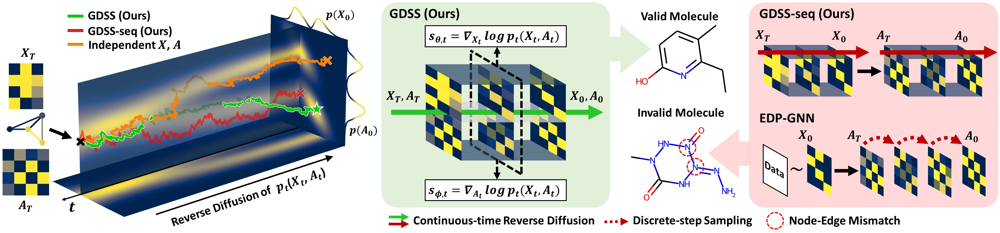

# Score-based Generative Modeling of Graphs via the System of Stochastic Differential Equations

Official Code Repository for the paper [Score-based Generative Modeling of Graphs via the System of Stochastic Differential Equations](https://arxiv.org/abs/2202.02514) (ICML 2022).

In this repository, we implement the *Graph Diffusion via the System of SDEs* (GDSS).

<p align="center">
    
</p>

## Contribution

+ We propose a novel score-based generative model for graphs that overcomes the limitation of previous generative methods, by introducing a diffusion process for graphs that can generate node features and adjacency simultaneously via the system of SDEs.
+ We derive novel training objectives to estimate the gradient of the joint log-density for the proposed diffusion process and further introduce an efficient integrator to solve the proposed system of SDEs.
+ We validate our method on both synthetic and real-world graph generation tasks, on which ours outperforms existing graph generative models.

## Dependencies

GDSS is built in **Python 3.7.0** and **Pytorch 1.10.1**. Please use the following command to install the requirements:

```sh
pip install -r requirements.txt
```

For molecule generation, additionally run the following command:

```sh
conda install -c conda-forge rdkit=2020.09.1.0
```


## Running Experiments


### 1. Preparations

We provide four **generic graph datasets** (Ego-small, Community_small, ENZYMES, and Grid) and two **molecular graph datasets** (QM9 and ZINC250k). 

We additionally provide the commands for generating generic graph datasets as follows:

```sh
python data/data_generators.py --dataset ${dataset_name}
```

To preprocess the molecular graph datasets for training models, run the following command:

```sh
python data/preprocess.py --dataset ${dataset_name}
python data/preprocess_for_nspdk.py --dataset ${dataset_name}
```

For the evaluation of generic graph generation tasks, run the following command to compile the ORCA program (see http://www.biolab.si/supp/orca/orca.html):

```sh
cd evaluation/orca 
g++ -O2 -std=c++11 -o orca orca.cpp
```


### 2. Configurations

The configurations are provided on the `config/` directory in `YAML` format. 
Hyperparameters used in the experiments are specified in the Appendix C of our paper.


### 3. Training

We provide the commands for the following tasks: Generic Graph Generation and Molecule Generation.

To train the score models, first modify `config/${dataset}.yaml` accordingly, then run the following command.

```sh
CUDA_VISIBLE_DEVICES=${gpu_ids} python main.py --type train --config ${train_config} --seed ${seed}
```

for example, 

```sh
CUDA_VISIBLE_DEVICES=0 python main.py --type train --config community_small --seed 42
```
and
```sh
CUDA_VISIBLE_DEVICES=0,1 python main.py --type train --config zinc250k --seed 42
```

### 4. Generation and Evaluation

To generate graphs using the trained score models, run the following command.

```sh
CUDA_VISIBLE_DEVICES=${gpu_ids} python main.py --type sample --config sample_qm9
```
or
```sh
CUDA_VISIBLE_DEVICES=${gpu_ids} python main.py --type sample --config sample_zinc250k
```


## Pretrained checkpoints

We provide checkpoints of the pretrained models on the `checkpoints/` directory, which are used in the main experiments.

+ `ego_small/gdss_ego_small.pth`
+ `community_small/gdss_community_small.pth`
+ `ENZYMES/gdss_enzymes.pth`
+ `grid/gdss_grid.pth`
+ `QM9/gdss_qm9.pth`
+ `ZINC250k/gdss_zinc250k.pth` 

We also provide a checkpoint of improved GDSS that uses GMH blocks instead of GCN blocks in $s_{\theta,t}$ (i.e., that uses `ScoreNetworkX_GMH` instead of `ScoreNetworkX`). The numbers of training epochs are 800 and 1000 for $s_{\theta,t}$ and $s_{\phi,t}$, respectively. For this checkpoint, use Rev. + Langevin solver and set `snr` as 0.2 and `scale_eps` as 0.8.

+ `ZINC250k/gdss_zinc250k_v2.pth` 

## Citation

If you found the provided code with our paper useful in your work, we kindly request that you cite our work.

```BibTex
@article{jo2022GDSS,
  author    = {Jaehyeong Jo and
               Seul Lee and
               Sung Ju Hwang},
  title     = {Score-based Generative Modeling of Graphs via the System of Stochastic
               Differential Equations},
  journal   = {arXiv:2202.02514},
  year      = {2022},
  url       = {https://arxiv.org/abs/2202.02514}
}
```
